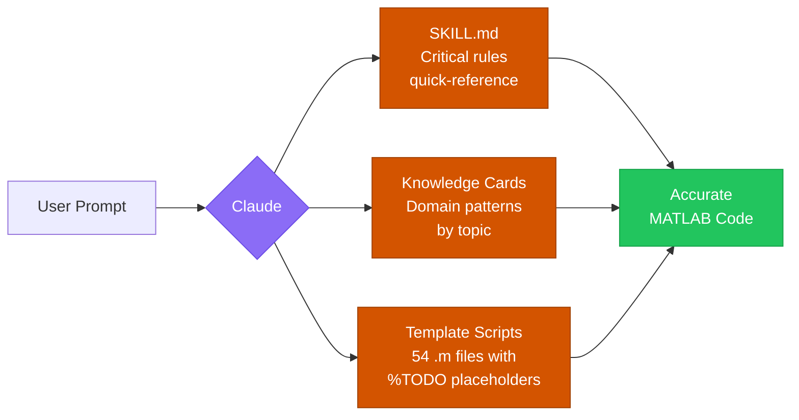

# MATLAB Toolbox Skills for Claude

<p align="center">
  <a href="LICENSE"><picture><source media="(prefers-color-scheme: dark)" srcset="https://mirrors.creativecommons.org/presskit/buttons/88x31/svg/by.svg"><source media="(prefers-color-scheme: light)" srcset="https://licensebuttons.net/l/by/4.0/88x31.png"></picture></a>
  <a href="https://www.mathworks.com/products/new_products/release2025b.html"></a>
</p>

<p align="center">
  <a href="https://claude.ai/new?q=Hi%21%20I%20found%20the%20MATLAB%20Toolbox%20Skills%20repo%20on%20GitHub%3A%0Ahttps%3A%2F%2Fgithub.com%2Frrmaram2000%2Fmatlab-toolbox-skills%0A%0AIt%20has%205%20skills%20for%20MATLAB%20R2025b%3A%0A-%20Medical%20Imaging%0A-%20Deep%20Learning%0A-%20Image%20Processing%0A-%20Stats-ML%0A-%20Wavelet%0A%0AEach%20skill%20comes%20with%20knowledge%20cards%20and%20template%20scripts%20that%20help%20you%20write%20accurate%20MATLAB%20code.%0A%0ACould%20you%3A%0A1.%20Give%20me%20a%20visual%20overview%20of%20how%20these%20skills%20work%20%E2%80%94%20use%20tables%20or%20diagrams%20where%20possible%0A2.%20Give%20a%20compact%20one-line%20description%20of%20each%20skill%20and%20help%20me%20figure%20out%20which%20ones%20fit%20my%20needs%0A3.%20Ask%20me%20which%20AI%20model%20or%20platform%20I%20use%2C%20then%20walk%20me%20through%20the%20setup%20instructions%20for%20it%0A%0AKeep%20things%20visual%20and%20concise%2C%20and%20feel%20free%20to%20ask%20me%20questions%20about%20my%20use%20case%21"></a>
  <a href="https://chatgpt.com/?q=Hi%21%20I%20found%20the%20MATLAB%20Toolbox%20Skills%20repo%20on%20GitHub%3A%0Ahttps%3A%2F%2Fgithub.com%2Frrmaram2000%2Fmatlab-toolbox-skills%0A%0AIt%20has%205%20skills%20for%20MATLAB%20R2025b%3A%0A-%20Medical%20Imaging%0A-%20Deep%20Learning%0A-%20Image%20Processing%0A-%20Stats-ML%0A-%20Wavelet%0A%0AEach%20skill%20comes%20with%20knowledge%20cards%20and%20template%20scripts%20that%20help%20you%20write%20accurate%20MATLAB%20code.%0A%0ACould%20you%3A%0A1.%20Give%20me%20a%20visual%20overview%20of%20how%20these%20skills%20work%20%E2%80%94%20use%20tables%20or%20diagrams%20where%20possible%0A2.%20Give%20a%20compact%20one-line%20description%20of%20each%20skill%20and%20help%20me%20figure%20out%20which%20ones%20fit%20my%20needs%0A3.%20Ask%20me%20which%20AI%20model%20or%20platform%20I%20use%2C%20then%20walk%20me%20through%20the%20setup%20instructions%20for%20it%0A%0AKeep%20things%20visual%20and%20concise%2C%20and%20feel%20free%20to%20ask%20me%20questions%20about%20my%20use%20case%21"></a>
  <a href="https://gemini.google.com/app?q=Hi%21%20I%20found%20the%20MATLAB%20Toolbox%20Skills%20repo%20on%20GitHub%3A%0Ahttps%3A%2F%2Fgithub.com%2Frrmaram2000%2Fmatlab-toolbox-skills%0A%0AIt%20has%205%20skills%20for%20MATLAB%20R2025b%3A%0A-%20Medical%20Imaging%0A-%20Deep%20Learning%0A-%20Image%20Processing%0A-%20Stats-ML%0A-%20Wavelet%0A%0AEach%20skill%20comes%20with%20knowledge%20cards%20and%20template%20scripts%20that%20help%20you%20write%20accurate%20MATLAB%20code.%0A%0ACould%20you%3A%0A1.%20Give%20me%20a%20visual%20overview%20of%20how%20these%20skills%20work%20%E2%80%94%20use%20tables%20or%20diagrams%20where%20possible%0A2.%20Give%20a%20compact%20one-line%20description%20of%20each%20skill%20and%20help%20me%20figure%20out%20which%20ones%20fit%20my%20needs%0A3.%20Ask%20me%20which%20AI%20model%20or%20platform%20I%20use%2C%20then%20walk%20me%20through%20the%20setup%20instructions%20for%20it%0A%0AKeep%20things%20visual%20and%20concise%2C%20and%20feel%20free%20to%20ask%20me%20questions%20about%20my%20use%20case%21"></a>
</p>

Claude writes confident MATLAB code, but it sometimes makes up function names that don't exist in R2025b. These skills fix that. They give Claude a quick-reference of tricky APIs, deprecated functions, and common pitfalls across 5 toolboxes, along with 54 template scripts that help it write code you can actually use.

---

## How it works



Each skill folder has three parts:

| Part | What it does |
|:-----|:-------------|
| **SKILL.md** | Quick-reference of critical rules: the tricky APIs, deprecated functions, and R2025b changes that LLMs miss |
| **Knowledge cards** | Domain patterns organized by topic (survival analysis, MedSAM, wavelet transforms, etc.) |
| **Template scripts** | `.m` files with `%TODO` placeholders. Claude uses these as a starting point and fills in the project-specific details like file paths, parameters, and class names |

---

## Available skills

| Skill | What it covers |
|:------|:---------------|
| `matlab-medical-imaging-toolbox` | DICOM/NIfTI I/O, MedSAM, Cellpose, radiomics, 3D visualization, coordinate transforms |
| `matlab-deep-learning` | U-Net, 3D U-Net, DeepLabv3+, Mask R-CNN, YOLO, custom training, ONNX export |
| `matlab-image-processing-toolbox` | MRI preprocessing, CT windowing, cell counting, histology, watershed, fluorescence |
| `matlab-stats-ml` | SVM, random forest, Cox survival, PCA, k-means, Bayesian optimization, SHAP |
| `matlab-wavelet-toolbox` | MRI denoising, CT denoising, speckle reduction, shearlets, dual-tree, deep learning wavelets |

---

## See the difference

I tested each skill by giving Claude the same prompt with and without the skill loaded. The evaluator didn't know which output had the skill.

<table>
<tr>
<td colspan="3">

*"Use MedSAM to segment a tumor from a CT volume in MATLAB. Mark points on one slice, propagate to full 3D volume."*

</td>
</tr>
<tr>
<th width="30%"></th>
<th width="35%">Without skill</th>
<th width="35%">With skill</th>
</tr>
<tr>
  <td>Model constructor</td>
  <td><code>medicalSAM</code><br><em>crashes, function doesn't exist</em></td>
  <td><code>medicalSegmentAnythingModel</code></td>
</tr>
<tr>
  <td>Embedding extraction</td>
  <td><code>imageEmbeddings</code><br><em>crashes, function doesn't exist</em></td>
  <td><code>extractEmbeddings</code></td>
</tr>
<tr>
  <td>Image normalization</td>
  <td><code>mat2clim</code><br><em>crashes, function doesn't exist</em></td>
  <td><code>mat2gray</code></td>
</tr>
<tr>
  <td>Volume I/O</td>
  <td><code>niftiread</code> / <code>niftiwrite</code><br><em>works, but loses spatial metadata</em></td>
  <td><code>medicalVolume</code> + <code>write</code><br><em>preserves geometry and orientation</em></td>
</tr>
<tr>
  <td>3D propagation</td>
  <td>"Loop over slices" (vague)</td>
  <td>Seed-and-propagate with centroid tracking</td>
</tr>
<tr>
  <td>Outcome</td>
  <td>Script crashes on line 1</td>
  <td>Complete working pipeline</td>
</tr>
</table>

> [All 5 examples →](docs/examples.md) · [How I tested →](#how-i-tested)

---

## Highlights (v2.0)

- 54 template scripts (`.m` files) that Claude uses as a starting point for your specific task, filling in paths, parameters, and data details
- Knowledge cards rewritten based on blind A/B testing. Cut what Claude already knows, added what it gets wrong.
- Better skill descriptions so they trigger when they should

---

## How I tested


- 17 prompts tested per skill, blind A/B
- Caught 8 hallucinated functions across 5 toolboxes
- Raw data in [`test-results/`](test-results/)

> [Full methodology →](docs/validation.md)

---

## Installation

Pre-built zip packages are in the [`zips/`](zips/) folder.

#### Claude Desktop

1. Download or clone this repository
2. Go to **Settings → Capabilities → Skills → Customize** and upload a zip from `zips/`
3. Toggle the skill on and start a new conversation

#### Claude.ai (Web)

Go to **Settings → Capabilities → Skills → Customize** and upload a zip from `zips/`.

#### Claude Code

Copy the skill folder to your skills directory:

```bash
# For all your projects (personal)
cp -r matlab-medical-imaging-toolbox ~/.claude/skills/

# Or for a specific project only
cp -r matlab-medical-imaging-toolbox .claude/skills/
```

See the [Claude Code skills documentation](https://code.claude.com/docs/en/skills) for details.

---

## Works with the MathWorks MATLAB MCP server

These skills pair well with the official [MATLAB MCP Core Server](https://github.com/matlab/matlab-mcp-core-server) from MathWorks:

|   | What it does |
|:--|:-------------|
| MCP Server | Code execution, syntax checking, toolbox detection |
| These skills | Toolbox-specific knowledge for accurate code generation |

See [MathWorks AI resources](https://github.com/matlab) for more.

---

## Contributing

Found an error? Have a suggestion? Open an [issue](../../issues) or see [CONTRIBUTING.md](CONTRIBUTING.md).

## License

<a href="https://creativecommons.org/licenses/by/4.0/"><picture><source media="(prefers-color-scheme: dark)" srcset="https://mirrors.creativecommons.org/presskit/buttons/88x31/svg/by.svg"><source media="(prefers-color-scheme: light)" srcset="https://licensebuttons.net/l/by/4.0/88x31.png"></picture></a>

This work is licensed under a [Creative Commons Attribution 4.0 International License](https://creativecommons.org/licenses/by/4.0/).
