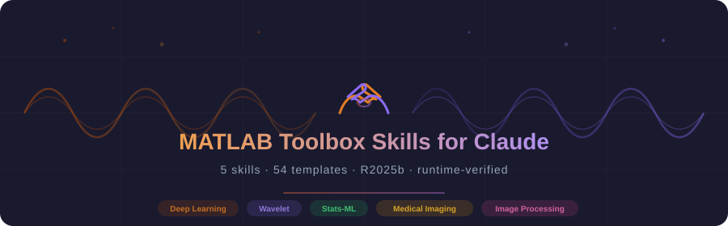

<p align="center">
  
</p>

<p align="center">
  <a href="LICENSE"></a>
  
  
  
  
</p>

<p align="center">
  Specialized knowledge that prevents API hallucinations and adds domain expertise<br>for 5 MATLAB toolboxes — with 54 runnable template scripts, all verified against R2025b.
</p>

---

## The Problem

LLMs confidently generate MATLAB function names that don't exist. These look plausible, pass code review, and crash at runtime:

```diff
- medsam = medicalSAM;
+ model = medicalSegmentAnythingModel('ExecutionEnvironment', 'gpu');
```
```diff
- trainedDetector = trainMaskRCNNObjectDetector(trainData, backbone, options);
+ detector = maskrcnn("resnet50-coco", classNames, InputSize=inputSize);
+ [trainedDetector, info] = trainMaskRCNN(trainData, detector, options);
```
```diff
- knnimpute(X)                        % requires Bioinformatics Toolbox
+ fillmissing(X, 'knn')              % works in Stats-ML Toolbox

- [h, p] = logrank(timeA, eventA, timeB, eventB);
+ [b, ~, ~, stats] = coxphfit(group, time, 'Censoring', cens);

- nll = pd.NegLogLikelihood;          % property does not exist
+ nll = negloglik(pd);               % use the function instead
```

These skills give Claude the edge-case API knowledge it needs to get MATLAB right. Every function reference has been runtime-verified against MATLAB R2025b.

> [See all 5 flagship examples with full code comparisons →](docs/examples.md)

---

## What's New in v2.0

- **54 template scripts** — runnable `.m` files for workflows like U-Net segmentation, radiomics extraction, survival analysis, and image denoising
- **Eval-driven knowledge cards** — trimmed content the model already knows, strengthened edge cases it gets wrong (based on blind A/B testing)
- **Reliable skill triggering** — improved descriptions so skills activate when they should
- **Modern R2025b APIs only** — all code uses current functions (`trainnet`, `unet`, `unet3d`), no legacy patterns
- **Runtime-verified** — every API claim tested against a live MATLAB R2025b installation

---

## Available Skills

| Skill | What It Covers | Templates |
|:------|:---------------|:---------:|
| `matlab-medical-imaging-toolbox` | DICOM/NIfTI I/O, MedSAM, Cellpose, radiomics, 3D visualization, coordinate transforms | 12 |
| `matlab-deep-learning` | U-Net, 3D U-Net, DeepLabv3+, Mask R-CNN, YOLO, custom training, ONNX export | 10 |
| `matlab-image-processing-toolbox` | MRI preprocessing, CT windowing, cell counting, histology, watershed, fluorescence | 10 |
| `matlab-stats-ml` | SVM, random forest, Cox survival, PCA, k-means, Bayesian optimization, SHAP | 12 |
| `matlab-wavelet-toolbox` | MRI denoising, CT denoising, speckle reduction, shearlets, dual-tree, deep learning wavelets | 10 |

---

## See the Difference

Each skill was tested in a blind A/B comparison — the same prompt given to Claude with and without the skill.

<br>

<table>
<tr>
<td colspan="3">

**How do I use MedSAM to segment a tumor from a CT volume in MATLAB?**

</td>
</tr>
<tr>
<th width="25%">Aspect</th>
<th width="37%">Without Skill</th>
<th width="38%">With Skill</th>
</tr>
<tr><td>Model constructor</td><td><code>medicalSAM</code> — does not exist</td><td><code>medicalSegmentAnythingModel</code></td></tr>
<tr><td>Embeddings</td><td><code>imageEmbeddings</code> — does not exist</td><td><code>extractEmbeddings</code></td></tr>
<tr><td>Normalization</td><td><code>mat2clim</code> — does not exist</td><td><code>mat2gray</code></td></tr>
<tr><td>Data loading</td><td><code>niftiread</code> (raw, no geometry)</td><td><code>medicalVolume</code> (preserves spatial ref)</td></tr>
<tr><td>3D propagation</td><td>"Loop over slices" (vague)</td><td>Seed-and-propagate with centroid tracking</td></tr>
<tr><td>Output saving</td><td><code>niftiwrite</code> (raw)</td><td><code>medicalVolume</code> + <code>write</code> (preserves geometry)</td></tr>
</table>

<br>

<table>
<tr>
<td colspan="3">

**Implement Macenko stain normalization for H&E histology images.**

</td>
</tr>
<tr>
<th width="25%">Aspect</th>
<th width="37%">Without Skill</th>
<th width="38%">With Skill</th>
</tr>
<tr><td>Algorithm</td><td>Histogram matching (<code>imhistmatch</code>)</td><td><strong>Full Macenko method</strong></td></tr>
<tr><td>OD-space conversion</td><td>Not implemented</td><td><code>-log10(I/255 + eps)</code></td></tr>
<tr><td>Background masking</td><td>Not implemented</td><td>OD threshold on tissue pixels</td></tr>
<tr><td>Stain vector estimation</td><td>Not implemented</td><td>PCA + percentile angle extraction</td></tr>
<tr><td>Stain separation</td><td>Not implemented</td><td>Matrix deconvolution into H and E channels</td></tr>
<tr><td>Result</td><td>Global color shift (no deconvolution)</td><td>True stain normalization with separated channels</td></tr>
</table>

<br>

> [See all 5 flagship examples →](docs/examples.md) · [Evaluation methodology →](docs/validation.md)

---

## Installation

Pre-built zip packages are available in the [`zips/`](zips/) folder.

#### Claude Desktop

1. Download or clone this repository
2. Go to **Settings → Capabilities → Skills → Customize** and upload a zip from `zips/`
3. Toggle the skill on and start a new conversation

#### Claude.ai (Web)

Go to **Settings → Capabilities → Skills → Customize** and upload a zip from `zips/`.

#### Claude Code

Copy the skill folder to your skills directory:

```bash
# For all your projects (personal)
cp -r matlab-medical-imaging-toolbox ~/.claude/skills/

# Or for a specific project only
cp -r matlab-medical-imaging-toolbox .claude/skills/
```

See the [Claude Code skills documentation](https://code.claude.com/docs/en/skills) for more details.

---

## Use with MathWorks MATLAB MCP Server

These skills work great alongside the official [MATLAB MCP Core Server](https://github.com/matlab/matlab-mcp-core-server) from MathWorks:

|   | What It Provides |
|:--|:-----------------|
| **MCP Server** | Code execution, syntax checking, toolbox detection |
| **These Skills** | Toolbox-specific knowledge for accurate code generation |

See [MathWorks AI resources](https://github.com/matlab) for more tools.

---

## Template Scripts

Each skill includes 8–12 ready-to-run `.m` template scripts — fill in the TODO sections with your data paths and go. All templates follow R2025b APIs exactly.

<details>
<summary><strong>Deep Learning (10 templates)</strong></summary>

| Template | Workflow |
|:---------|:---------|
| `template_transfer_learning_classification.m` | Fine-tune ResNet-50/EfficientNet for medical image classification |
| `template_unet_segmentation.m` | 2D U-Net for organ/tumor segmentation |
| `template_deeplabv3plus_segmentation.m` | DeepLabv3+ for histopathology |
| `template_3d_volumetric_segmentation.m` | 3D U-Net for CT/MRI volumes |
| `template_object_detection_yolov4.m` | YOLOv4 for nodule/lesion detection |
| `template_custom_training_loop.m` | dlarray-based custom training with Dice+CE loss |
| `template_data_augmentation_pipeline.m` | Medical image augmentation (2D and 3D) |
| `template_model_export_onnx.m` | Export to ONNX for deployment |
| `template_class_imbalance_handling.m` | Weighted loss, oversampling, focal loss |
| `template_maskrcnn_instance_seg.m` | Mask R-CNN for cell/nuclei instance segmentation |

</details>

<details>
<summary><strong>Image Processing (10 templates)</strong></summary>

| Template | Workflow |
|:---------|:---------|
| `template_mri_preprocessing.m` | Bias correction + CLAHE + brain masking |
| `template_ct_windowing.m` | CT window/level presets for different tissues |
| `template_cell_counting.m` | Automated cell counting with watershed separation |
| `template_histology_stain_normalization.m` | H&E Macenko stain normalization |
| `template_watershed_segmentation.m` | Standard + marker-controlled watershed |
| `template_morphological_cleanup.m` | Binary mask cleanup pipeline |
| `template_adaptive_thresholding.m` | Multi-level thresholding for tissue |
| `template_large_image_blockproc.m` | Block processing for whole-slide images |
| `template_edge_detection_pipeline.m` | Edge detection + active contour refinement |
| `template_fluorescence_quantification.m` | Multi-channel fluorescence analysis |

</details>

<details>
<summary><strong>Medical Imaging (12 templates)</strong></summary>

| Template | Workflow |
|:---------|:---------|
| `template_dicom_series_loader.m` | Load and organize DICOM series |
| `template_nifti_volume_processing.m` | NIfTI load, process, save pipeline |
| `template_volume_visualization.m` | 3D volume rendering with overlays |
| `template_rigid_registration.m` | Rigid registration of pre/post scans |
| `template_deformable_registration.m` | Non-rigid registration pipeline |
| `template_radiomics_extraction.m` | IBSI-compliant radiomics features |
| `template_medsam_segmentation.m` | MedSAM interactive segmentation |
| `template_cellpose_segmentation.m` | Cellpose cell/nuclei detection |
| `template_pacs_query_retrieve.m` | PACS server integration |
| `template_coordinate_transform.m` | Patient-voxel coordinate transforms |
| `template_multimodal_fusion.m` | PET/CT or multi-sequence fusion |
| `template_labeling_workflow.m` | Ground truth creation pipeline |

</details>

<details>
<summary><strong>Statistics & ML (12 templates)</strong></summary>

| Template | Workflow |
|:---------|:---------|
| `template_svm_classification.m` | SVM for patient classification |
| `template_random_forest_ensemble.m` | Random forest for biomarker prediction |
| `template_cox_survival_analysis.m` | Cox regression + Kaplan-Meier curves |
| `template_pca_feature_reduction.m` | PCA for high-dimensional biodata |
| `template_kmeans_patient_clustering.m` | K-means patient stratification |
| `template_bayesopt_hyperparameter.m` | Bayesian hyperparameter optimization |
| `template_cross_validation_pipeline.m` | k-fold CV with comprehensive metrics |
| `template_distribution_fitting.m` | Fit distributions to clinical data |
| `template_hypothesis_testing.m` | t-test / ANOVA for treatment comparison |
| `template_shapley_interpretability.m` | SHAP values for model explanation |
| `template_glm_regression.m` | GLM for clinical outcome prediction |
| `template_missing_data_handling.m` | KNN + multiple imputation strategies |

</details>

<details>
<summary><strong>Wavelet (10 templates)</strong></summary>

| Template | Workflow |
|:---------|:---------|
| `template_mri_denoising.m` | Rician noise removal from MRI |
| `template_ct_denoising.m` | Low-dose CT denoising |
| `template_ultrasound_speckle.m` | Speckle reduction in ultrasound |
| `template_wavelet_feature_extraction.m` | Multi-scale texture features |
| `template_dual_tree_directional.m` | Directional analysis (vessels/fibers) |
| `template_shearlet_curvilinear.m` | Shearlet for curvilinear structures |
| `template_custom_lifting_wavelet.m` | Custom wavelet via lifting scheme |
| `template_image_fusion.m` | Multi-modal image fusion |
| `template_deep_learning_wavelet.m` | Differentiable DWT in neural networks |
| `template_multiresolution_analysis.m` | Multi-level decomposition analysis |

</details>

---

## Contributing

Found an error? Have a suggestion? Contributions are welcome.

- **Report issues** — Open an [issue](../../issues) to report bugs or suggest improvements
- **Submit fixes** — See [CONTRIBUTING.md](CONTRIBUTING.md) for guidelines

All feedback is appreciated.

## License

<a href="https://creativecommons.org/licenses/by/4.0/"></a>

This work is licensed under a [Creative Commons Attribution 4.0 International License](https://creativecommons.org/licenses/by/4.0/).
