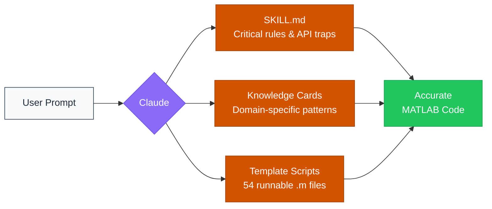
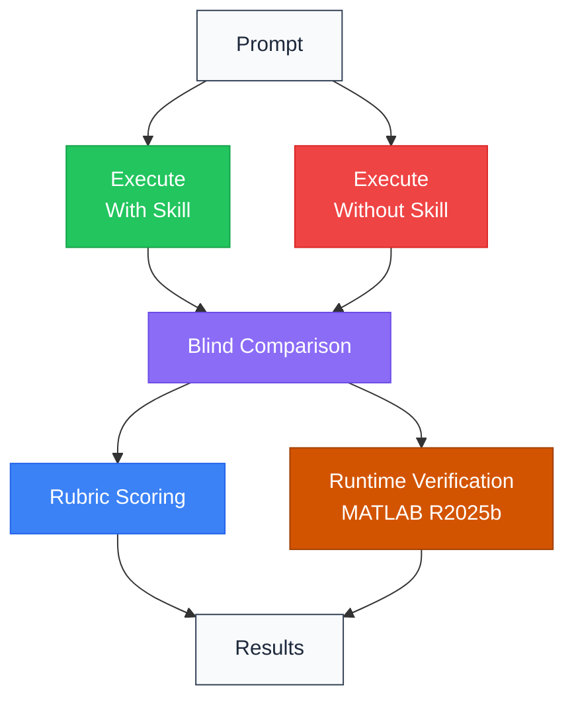

# MATLAB Toolbox Skills for Claude

<p align="center">
  <a href="LICENSE"></a>
  
  
  
  
</p>

I built these because Claude keeps inventing MATLAB functions that don't exist. These skills teach it the actual R2025b APIs, including the ones it consistently gets wrong, along with 54 template scripts you can run directly.

---

## The problem

Ask Claude to use MedSAM in MATLAB and it'll write `medicalSAM` with total confidence. That function doesn't exist. The real one is `medicalSegmentAnythingModel`. Same story across toolboxes:

```diff
- medsam = medicalSAM;
+ model = medicalSegmentAnythingModel('ExecutionEnvironment', 'gpu');
```
```diff
- trainedDetector = trainMaskRCNNObjectDetector(trainData, backbone, options);
+ detector = maskrcnn("resnet50-coco", classNames, InputSize=inputSize);
+ [trainedDetector, info] = trainMaskRCNN(trainData, detector, options);
```
```diff
- knnimpute(X)                        % requires Bioinformatics Toolbox
+ fillmissing(X, 'knn')              % works in Stats-ML Toolbox

- [h, p] = logrank(timeA, eventA, timeB, eventB);
+ [b, ~, ~, stats] = coxphfit(group, time, 'Censoring', cens);

- nll = pd.NegLogLikelihood;          % property does not exist
+ nll = negloglik(pd);               % use the function instead
```

I went through the R2025b documentation and built skill files that correct these gaps. Every function reference has been checked against the docs.

> [All 5 examples with full code comparisons →](docs/examples.md)

---

## What changed in v2.0

- 54 template scripts you can actually run (`.m` files for U-Net, radiomics, survival analysis, denoising, etc.)
- Knowledge cards rewritten based on blind A/B testing. Cut what Claude already knows, added what it gets wrong.
- Better skill descriptions so they trigger when they should
- All code targets R2025b (`trainnet`, `unet`, `unet3d`). No legacy APIs.
- Every API claim checked against R2025b documentation

---

## Available skills

| Skill | What it covers | Templates |
|:------|:---------------|:---------:|
| `matlab-medical-imaging-toolbox` | DICOM/NIfTI I/O, MedSAM, Cellpose, radiomics, 3D visualization, coordinate transforms | 12 |
| `matlab-deep-learning` | U-Net, 3D U-Net, DeepLabv3+, Mask R-CNN, YOLO, custom training, ONNX export | 10 |
| `matlab-image-processing-toolbox` | MRI preprocessing, CT windowing, cell counting, histology, watershed, fluorescence | 10 |
| `matlab-stats-ml` | SVM, random forest, Cox survival, PCA, k-means, Bayesian optimization, SHAP | 12 |
| `matlab-wavelet-toolbox` | MRI denoising, CT denoising, speckle reduction, shearlets, dual-tree, deep learning wavelets | 10 |

---

## See the difference

I tested each skill by giving Claude the same prompt with and without the skill loaded. The evaluator didn't know which output had the skill.

<table>
<tr>
<td colspan="3">

*"Use MedSAM to segment a tumor from a CT volume in MATLAB. Mark points on one slice, propagate to full 3D volume."*

</td>
</tr>
<tr>
<th width="30%">What</th>
<th width="35%">Without skill</th>
<th width="35%">With skill</th>
</tr>
<tr>
  <td>Model constructor</td>
  <td><code>medicalSAM</code><br><em>crashes, function doesn't exist</em></td>
  <td><code>medicalSegmentAnythingModel</code></td>
</tr>
<tr>
  <td>Embedding extraction</td>
  <td><code>imageEmbeddings</code><br><em>crashes, function doesn't exist</em></td>
  <td><code>extractEmbeddings</code></td>
</tr>
<tr>
  <td>Image normalization</td>
  <td><code>mat2clim</code><br><em>crashes, function doesn't exist</em></td>
  <td><code>mat2gray</code></td>
</tr>
<tr>
  <td>Volume I/O</td>
  <td><code>niftiread</code> / <code>niftiwrite</code><br><em>works, but loses spatial metadata</em></td>
  <td><code>medicalVolume</code> + <code>write</code><br><em>preserves geometry and orientation</em></td>
</tr>
<tr>
  <td>3D propagation</td>
  <td>"Loop over slices" (vague)</td>
  <td>Seed-and-propagate with centroid tracking, area-ratio stopping</td>
</tr>
<tr>
  <td>Outcome</td>
  <td>Script crashes on line 1</td>
  <td>Complete 10-step pipeline</td>
</tr>
</table>

> [All 5 examples →](docs/examples.md) · [How I tested →](docs/validation.md)

---

## How it works



Each skill folder has three parts:

| Layer | What it does | Example |
|:------|:-------------|:--------|
| SKILL.md | Lists the rules Claude gets wrong without help | "`logrank()` does not exist, use `coxphfit`" |
| Knowledge cards | Domain patterns, organized by topic | Survival analysis, MedSAM workflow, wavelet transforms |
| Template scripts | `.m` files with TODO placeholders, ready to run | `template_maskrcnn_instance_seg.m` |

---

## How I tested



- 17 prompts tested per skill, blind A/B
- Caught 8 hallucinated functions across 5 toolboxes
- Checked every API against R2025b documentation
- Raw data in [`test-results/`](test-results/)

> [Full methodology →](docs/validation.md)

---

## Installation

Pre-built zip packages are in the [`zips/`](zips/) folder.

#### Claude Desktop

1. Download or clone this repository
2. Go to **Settings → Capabilities → Skills → Customize** and upload a zip from `zips/`
3. Toggle the skill on and start a new conversation

#### Claude.ai (Web)

Go to **Settings → Capabilities → Skills → Customize** and upload a zip from `zips/`.

#### Claude Code

Copy the skill folder to your skills directory:

```bash
# For all your projects (personal)
cp -r matlab-medical-imaging-toolbox ~/.claude/skills/

# Or for a specific project only
cp -r matlab-medical-imaging-toolbox .claude/skills/
```

See the [Claude Code skills documentation](https://code.claude.com/docs/en/skills) for details.

---

## Works with the MathWorks MATLAB MCP server

These skills pair well with the official [MATLAB MCP Core Server](https://github.com/matlab/matlab-mcp-core-server) from MathWorks:

|   | What it does |
|:--|:-------------|
| MCP Server | Code execution, syntax checking, toolbox detection |
| These skills | Toolbox-specific knowledge for accurate code generation |

See [MathWorks AI resources](https://github.com/matlab) for more.

---

## Contributing

Found an error? Have a suggestion? Open an [issue](../../issues) or see [CONTRIBUTING.md](CONTRIBUTING.md).

## License

<a href="https://creativecommons.org/licenses/by/4.0/"></a>

This work is licensed under a [Creative Commons Attribution 4.0 International License](https://creativecommons.org/licenses/by/4.0/).
